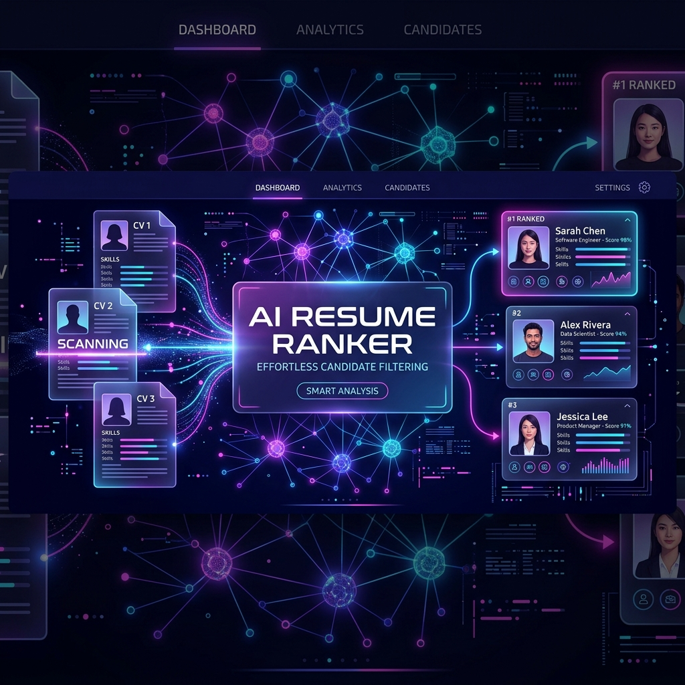
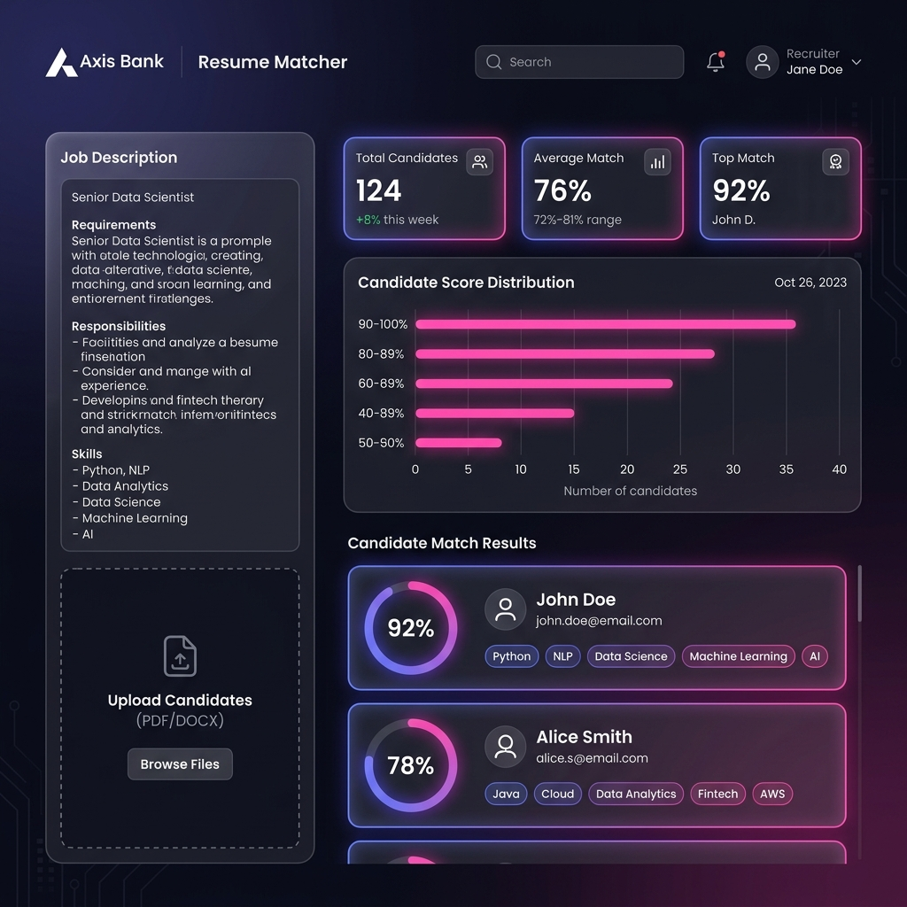

# AI Resume Ranking & Screening System 📝💻



An interactive, high-tech recruitment intelligence dashboard designed to streamline candidate screening using Natural Language Processing (NLP) and semantic text analysis. It analyzes and ranks PDF resumes against a job description, providing recruiters with visual dashboards, score comparisons, and downloadable reports.

---

## 🚀 Key Features

* **🧠 Smart Entity Extraction**: Automatically extracts candidate names and emails using pre-loaded **spaCy NER** (Named Entity Recognition) models and regex fallbacks.
* **📊 Semantic Similarity Matching**: Computes accurate TF-IDF vector representations of job descriptions and resumes, ranking candidates using **Cosine Similarity** scores.
* **📈 Interactive Data Visualizations**: Renders dynamic score distribution graphs using **Chart.js** directly on the dashboard.
* **📁 Cumulative Drag & Drop Upload**: A custom styled glassmorphic dropzone allows recruiters to upload multiple resumes in rounds, managing files seamlessly in a queue before analysis.
* **🔎 Search & Score Filtering**: Real-time client-side search by candidate name, email, or skill badges, combined with a match score range slider.
* **🎨 Dual-Theme Design**: Sleek floating dark mode (default indigo/fuchsia neon space) and slate-light mode toggles with smooth transitions.
* **📥 Instant CSV Reports**: Quick export of candidate rankings, emails, match scores, and filenames with a single click.

---

## 🖥️ User Interface Preview



---

## 🛠️ Setup and Usage

Follow these steps to run the application locally:

### 1. Clone the repository:
```sh
git clone https://github.com/samriddhi04singh-collab/AI-resume-ranking-system.git
cd AI-resume-ranking-system
```

### 2. Install dependencies:
Install the required libraries (we recommend using the latest package releases):
```sh
pip install -r requirements.txt
```

### 3. Run the Flask application:
```sh
python app.py
```

### 4. Access the web app:
Open your browser and navigate to:
👉 **[http://localhost:5000](http://localhost:5000)**

---

## 📁 Directory Structure
```
├── app.py                  # Flask server containing NLP matching & entity parsing
├── resume_ranker.py        # CLI version of the analyzer script
├── static/
│   └── styles.css          # Design system stylesheet (Light/Dark themes)
├── templates/
│   └── index.html          # Recruiter dashboard UI template (Chart.js / Lucide Icons)
├── uploads/                # Temporary directory storing candidate files
├── readme_banner.png       # AI-generated header illustration
├── dashboard_preview.png   # Website visual mockup screenshot
├── requirements.txt        # Python package dependencies
└── README.md               # Repository documentation
```

---

## 👩‍💻 Developer

Developed with ❤️ by **Samriddhi Singh**

* **GitHub**: [@samriddhi04singh-collab](https://github.com/samriddhi04singh-collab)
* **Email**: [samriddhi04singh@gmail.com](mailto:samriddhi04singh@gmail.com)
